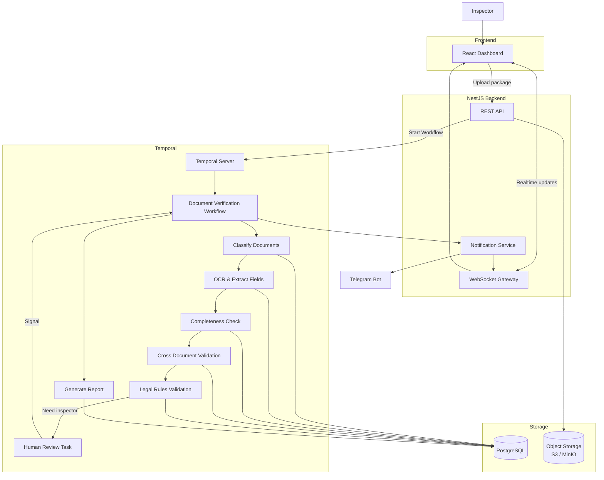

# ADR 001: Multi-Stage Orchestrated Document Verification Architecture

## Context

The Real Estate Registration Authority needs an AI-assisted document verification system that:

- Processes multi-page, multi-format document packages (PDF, JPG, PNG)
- Handles multiple languages (Azerbaijani Latin/Cyrillic scripts)
- Requires complex validation workflows with human intervention loops
- Needs real-time progress updates to inspectors
- Must maintain audit trail and structured data for registry integration

Traditional request-response architectures struggle with:

- Long-running verification processes (OCR, multiple validation stages)
- Human review loops that can take hours or days
- Complex state management across verification stages
- Need to track intermediate results and resume workflows

## Decision

We adopt a **multi-stage orchestrated workflow architecture** with the following components:

### 1. **Temporal for Workflow Orchestration**

- Manages long-running document verification workflows
- Provides built-in retry logic, timeouts, and resumable workflows
- Enables human review task ("activities") that can pause/wait for inspector input
- Maintains complete workflow history for audit trails

### 2. **NestJS + WebSocket Backend**

- **REST API**: Document upload, metadata queries, webhook endpoints
- **WebSocket Gateway**: Real-time progress updates as verification stages complete
- **Notification Service**: Async notifications (email, Telegram, in-app)

### 3. **Layered Verification Pipeline**

The workflow executes in stages (atomic activities), allowing:

- Efficient parallel processing where possible
- Clear audit trail of what happened and when
- Human intervention at validation gates (Stage 7)

| Stage               | Purpose                                                           | Output                     |
| ------------------- | ----------------------------------------------------------------- | -------------------------- |
| 1. Classify         | ML model categorizes documents by type                            | Document categories stored |
| 2. OCR & Extract    | Extract structured fields from identified documents               | JSON fields in DB          |
| 3. Completeness     | Verify required documents present                                 | List of missing docs       |
| 4. Cross-Validation | Check consistency across documents (names, addresses, parcel IDs) | Validation issues list     |
| 5. Legal Rules      | Apply business rules (measurement accuracy, date validity)        | Rule violations list       |
| 6. Generate Report  | Compile findings with confidence scores                           | PDF/JSON report            |
| 7. Human Review     | Inspector reviews and approves/requests corrections               | Human signal to workflow   |

### 4. **Separate Concerns**

- **PostgreSQL**: Structured application data (users, document metadata, validation results)
- **Object Storage (S3/MinIO)**: Raw documents, OCR images, generated reports
- Decouples compute-heavy OCR/ML from transactional database

### 5. **Event-Driven Updates**

- Workflow completion → Notification Service → WebSocket → Inspector UI (real-time)
- Alternative channels: Telegram Bot for critical alerts
- Inspector can check status anytime via REST API

## Architecture Diagram

## Rationale

**Why Temporal?**

- Temporal handles the complexity of long-running, multi-step workflows
- Built-in compensation (retry, timeout, dead-letter queues)
- Human review loops (activities waiting for signals) are native use cases
- Complete audit trail: what happened, when, in what order
- Can pause/resume workflows when inspector needs time to decide

## Alternatives Considered

| Approach                            | Pros                | Cons                                                | Why Not?                                                 |
| ----------------------------------- | ------------------- | --------------------------------------------------- | -------------------------------------------------------- |
| **Synchronous API** (current model) | Simple, familiar    | Timeouts on long-running OCR, no human loop support | Can't handle hour-long workflows                         |
| **Job Queue (Bull, RabbitMQ)**      | Lightweight, proven | Manual retry logic, harder to track workflow state  | Less suitable for multi-stage workflows with human gates |
| **Custom Workflow**                 | Full control        | Massive engineering effort, maintenance burden      | Reinventing the wheel                                    |

## Implementation Notes

1. **Workflow Activities** map to verification stages (S1–S7)
2. **Human Review Signal**: S7 activity waits for `signal_human_decision` with `approve` or `revise` payload
3. **Failure Handling**: Activities auto-retry on transient errors (OCR service down); surface permanent failures to inspector
4. **Progress Notifications**: Temporal sends event on activity completion → Notification Service → WebSocket
5. **Audit Trail**: Query Temporal's workflow history for "what happened to this document package?"

## Related Decisions

- ADR 002: Document Classification Model Selection
- ADR 003: OCR Engine & Language Support
- ADR 004: Data Retention & Compliance Policies
