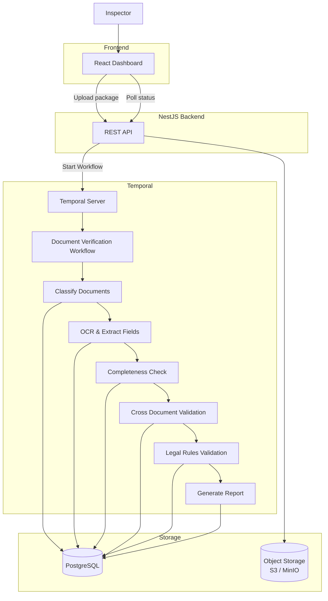

# MVP — AI Document Verification System

## 1. Goal

Build an MVP of an AI-assisted document verification system for government real estate registration.

**The system does not make legal decisions.**

Its purpose is to help an inspector quickly verify submitted document packages by:

- collecting uploaded documents
- recognizing document types
- extracting structured data
- validating completeness
- checking consistency between documents
- producing a verification report

The final approval is always performed by a human inspector.

## 2. Scope

The MVP focuses on a single verification flow:

```
Upload Package
      ↓
Store files
      ↓
Split PDFs into pages
      ↓
OCR
      ↓
Document Classification
      ↓
Field Extraction
      ↓
Validation
      ↓
Verification Report
```

Human review workflows and notifications are intentionally left outside the MVP. Orchestration of the pipeline is handled by Temporal (see section 7).

## 3. Supported Input

### File formats

- PDF
- JPG
- JPEG
- PNG

### Upload

A verification package may contain multiple files.

Example:

```
package/
├── passport.pdf
├── driver_license.jpg
└── application.pdf
```

## 4. Functional Requirements

### 4.1 Upload Package

User uploads one or more files.

Backend should:

- create Verification Package
- upload originals to S3
- store metadata in PostgreSQL
- create Temporal workflow

### 4.2 PDF Processing

Every PDF is automatically split into pages. Each page becomes an individual image for OCR.

Example:

```
passport.pdf
      ↓
page_1.png
page_2.png
```

### 4.3 OCR

Each page is sent to a third-party OCR provider.

The OCR provider returns:

- recognized text
- bounding boxes (optional)
- confidence score

The backend stores OCR results.

### 4.4 Document Classification

Each processed document is classified.

Supported document types:

- Passport
- Driver License
- Rental Application
- Unknown

Example:

```
page → Passport
```

### 4.5 Field Extraction

Depending on the detected document type, the system extracts structured fields.

**Passport** — example fields:

- First Name
- Last Name
- Date of Birth
- Passport Number
- Expiration Date

**Driver License** — example fields:

- First Name
- Last Name
- License Number
- Expiration Date

**Rental Application** — example fields:

- Applicant Name
- Passport Number
- Driver License Number

Each extracted field stores:

- value
- confidence
- page number

### 4.6 Validation

The backend performs simple hardcoded validation rules.

#### Required documents

Rental application requires:

- Passport
- Driver License

Missing documents should be reported.

#### Cross-document validation

Examples:

| Document       | Field           |            | Document           | Field                 |
| -------------- | --------------- | ---------- | ------------------ | --------------------- |
| Passport       | First Name      | must equal | Driver License     | First Name            |
| Passport       | Last Name       | must equal | Driver License     | Last Name             |
| Passport       | Passport Number | must equal | Rental Application | Passport Number       |
| Driver License | License Number  | must equal | Rental Application | Driver License Number |

#### Expiration validation

Check:

- passport expiration
- driver license expiration

#### OCR confidence

Fields below a configured confidence threshold should be flagged.

Example:

```
confidence < 0.80 → Needs review
```

## 5. Verification Report

The final output is a structured report.

Overall status:

- OK
- Issues Found
- Incomplete Package

Report contains:

- detected documents
- extracted fields
- validation errors
- missing documents
- mismatched values
- OCR confidence
- page references

Example:

```
Status
  Issues Found
---
Missing Documents
  None
---
Validation
  Passport Name != Driver License Name
  Page 1
  Confidence 0.92
---
Expired Documents
  Driver License
---
Low Confidence
  Passport Number
  Confidence 0.61
```

## 6. User Interface

### Dashboard

Displays verification packages.

Columns:

- Package ID
- Created At
- Status
- Progress

### Upload Page

User can:

- upload files
- create package
- start verification

### Verification Details

Shows:

```
Uploaded documents
      ↓
OCR result
      ↓
Extracted fields
      ↓
Validation report
```

Each issue links to:

- page
- field
- confidence

## 7. Architecture — Temporal Workflow Orchestration

### Context

The verification pipeline is long-running and involves unstable external dependencies (third-party OCR provider, classification model). Traditional request-response architectures struggle with:

- Long-running verification processes (OCR, multiple validation stages)
- Transient failures of external services requiring retries
- Complex state management across verification stages
- Need to track intermediate results and resume workflows

### Decision

We adopt **Temporal** to orchestrate the verification workflow:

- Manages the long-running document verification workflow as a single durable execution
- Provides built-in retry logic, timeouts, and resumable workflows
- Maintains complete workflow history for audit trails

### Verification Pipeline

The workflow executes in stages (atomic activities), allowing:

- Efficient parallel processing where possible
- Clear audit trail of what happened and when

| Stage               | Purpose                                                           | Output                     |
| ------------------- | ----------------------------------------------------------------- | -------------------------- |
| 1. Classify         | ML model categorizes documents by type                            | Document categories stored |
| 2. OCR & Extract    | Extract structured fields from identified documents               | JSON fields in DB          |
| 3. Completeness     | Verify required documents present                                 | List of missing docs       |
| 4. Cross-Validation | Check consistency across documents (names, addresses, parcel IDs) | Validation issues list     |
| 5. Legal Rules      | Apply business rules (measurement accuracy, date validity)        | Rule violations list       |
| 6. Generate Report  | Compile findings with confidence scores                           | PDF/JSON report            |

### Components

- **NestJS Backend (REST API)**: Document upload, metadata queries, workflow start, status polling
- **PostgreSQL**: Structured application data (users, document metadata, validation results)
- **Object Storage (S3/MinIO)**: Raw documents, OCR images, generated reports — decouples compute-heavy OCR/ML from the transactional database

The inspector checks verification status via the REST API (polling); real-time push updates and notification channels are out of MVP scope.

### Architecture Diagram



### Rationale

**Why Temporal?**

- Temporal handles the complexity of long-running, multi-step workflows
- Built-in compensation (retry, timeout, dead-letter queues) for unstable external calls (OCR provider, ML model)
- Complete audit trail: what happened, when, in what order
- Workflows survive worker restarts and resume from the last completed activity

### Alternatives Considered

| Approach                            | Pros                | Cons                                               | Why Not?                                    |
| ----------------------------------- | ------------------- | -------------------------------------------------- | ------------------------------------------- |
| **Synchronous API** (current model) | Simple, familiar    | Timeouts on long-running OCR, fragile retries      | Can't handle long-running workflows         |
| **Job Queue (Bull, RabbitMQ)**      | Lightweight, proven | Manual retry logic, harder to track workflow state | Less suitable for multi-stage workflows     |
| **Custom Workflow**                 | Full control        | Massive engineering effort, maintenance burden     | Reinventing the wheel                       |

### Implementation Notes

1. **Workflow Activities** map to verification stages (S1–S6)
2. **Failure Handling**: Activities auto-retry on transient errors (OCR service down); surface permanent failures to the inspector via package status
3. **Audit Trail**: Query Temporal's workflow history for "what happened to this document package?"

### Related Decisions

- ADR 002: Document Classification Model Selection
- ADR 003: OCR Engine & Language Support
- ADR 004: Data Retention & Compliance Policies
