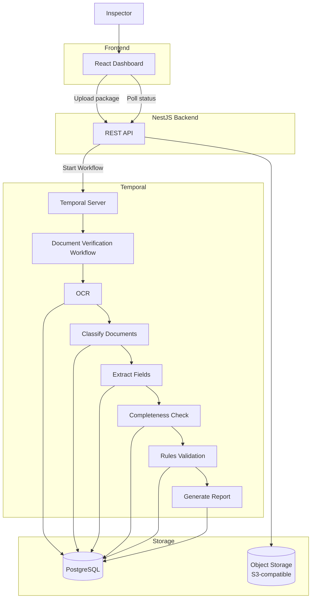

# MVP — AI Document Verification System

## 1. Goal

Build an MVP of an AI-assisted document verification system for government registration workflows. The target domain is real estate / cadastre registration, but the verification mechanism itself is domain-agnostic (see Verification Profiles, section 4.6).

**The system does not make legal decisions.**

Its purpose is to help an inspector quickly verify submitted document packages by:

- collecting uploaded documents
- recognizing document types
- extracting structured data
- validating completeness
- checking consistency between documents
- producing a verification report

The final approval is always performed by a human inspector.

## 2. Scope

The MVP focuses on a single verification flow:

```
Upload Package
      ↓
Store files
      ↓
Split PDFs into pages
      ↓
OCR
      ↓
Document Classification
      ↓
Field Extraction
      ↓
Validation
      ↓
Verification Report
```

Human review workflows and notifications are intentionally left outside the MVP. Orchestration of the pipeline is handled by Temporal (see section 7).

## 3. Supported Input

### File formats

- PDF
- JPG
- JPEG
- PNG

### Upload

A verification package may contain multiple files.

**Each uploaded file is treated as exactly one document.** Files containing multiple logical documents (e.g. a passport and a license scanned into one PDF) are out of MVP scope.

Example:

```
package/
├── passport.pdf
├── driver_license.jpg
└── application.pdf
```

## 4. Functional Requirements

### 4.1 Upload Package

User uploads one or more files.

Backend should:

- create Verification Package
- upload originals to object storage
- store metadata in PostgreSQL
- start the verification pipeline

### 4.2 PDF Processing

Every PDF is automatically split into pages. Each page becomes an individual image for OCR.

Example:

```
passport.pdf
      ↓
page_1.png
page_2.png
```

### 4.3 OCR

Each page is sent to an OCR provider (behind the `OcrProvider` port, see ADR-0003).

The OCR provider returns:

- recognized text
- bounding boxes (optional)
- confidence score

The backend stores OCR results.

### 4.4 Document Classification

Each document is classified based on the OCR text of its pages (one type per document — see section 3). The set of recognizable document types is defined by the active Verification Profile.

The demo profile ships with:

- Passport
- Driver License
- Application
- Unknown

Example:

```
passport.pdf → Passport
```

### 4.5 Field Extraction

Depending on the detected document type, the system extracts structured fields. Field schemas are defined per document type in the Verification Profile.

Demo profile — **Passport**:

- First Name
- Last Name
- Date of Birth
- Passport Number
- Expiration Date

Demo profile — **Driver License**:

- First Name
- Last Name
- License Number
- Expiration Date

Demo profile — **Application**:

- Applicant Name
- Passport Number
- Driver License Number

Each extracted field stores:

- value
- confidence
- page number

### 4.6 Validation — Verification Profiles

Validation is driven by a **Verification Profile** — a declarative definition of what a valid package looks like: document types, field schemas, required documents, and cross-document rules (see ADR-0002). The engine interprets profiles; adding a new domain (e.g. cadastre document sets) means adding a profile, not changing the engine.

The MVP ships one demo profile exercising every rule kind:

#### Required documents

The demo profile requires:

- Passport
- Driver License

Missing documents should be reported.

#### Cross-document validation

Examples from the demo profile:

| Document       | Field           |            | Document       | Field                 |
| -------------- | --------------- | ---------- | -------------- | --------------------- |
| Passport       | First Name      | must equal | Driver License | First Name            |
| Passport       | Last Name       | must equal | Driver License | Last Name             |
| Passport       | Passport Number | must equal | Application    | Passport Number       |
| Driver License | License Number  | must equal | Application    | Driver License Number |

#### Expiration validation

Check expiration dates on documents whose profile schema declares an expiration field (demo: passport, driver license).

#### OCR confidence

Fields below a configured confidence threshold should be flagged.

Example:

```
confidence < 0.80 → Needs review
```

## 5. Verification Report

The final output is a structured report.

Overall status:

- OK
- Issues Found
- Incomplete Package

Report contains:

- detected documents
- extracted fields
- validation issues
- missing documents
- mismatched values
- OCR confidence
- page references

Example:

```
Status
  Issues Found
---
Missing Documents
  None
---
Validation
  Passport Name != Driver License Name
  Page 1
  Confidence 0.92
---
Expired Documents
  Driver License
---
Low Confidence
  Passport Number
  Confidence 0.61
```

## 6. User Interface

### Dashboard

Displays verification packages.

Columns:

- Package ID
- Created At
- Status
- Progress

### Upload Page

User can:

- upload files
- create package
- start verification

### Verification Details

Shows:

```
Uploaded documents
      ↓
OCR result
      ↓
Extracted fields
      ↓
Validation report
```

Each issue links to:

- page
- field
- confidence

## 7. Architecture — Temporal Workflow Orchestration

### Context

The verification pipeline is long-running and involves unstable external dependencies (third-party OCR provider, classification model). Traditional request-response architectures struggle with:

- Long-running verification processes (OCR, multiple validation stages)
- Transient failures of external services requiring retries
- Complex state management across verification stages
- Need to track intermediate results and resume workflows

### Decision

We adopt **Temporal** to orchestrate the verification workflow:

- Manages the long-running document verification workflow as a single durable execution
- Provides built-in retry logic, timeouts, and resumable workflows
- Maintains complete workflow history for audit trails

### Verification Pipeline

The workflow executes in stages (atomic activities), allowing:

- Efficient parallel processing where possible
- Clear audit trail of what happened and when

| Stage               | Purpose                                                       | Output                     |
| ------------------- | ------------------------------------------------------------- | -------------------------- |
| 1. OCR              | Recognize text on every page                                  | OCR results stored         |
| 2. Classify         | Determine each document's type from its OCR text              | Document types stored      |
| 3. Extract Fields   | Extract structured fields per the profile's field schemas     | JSON fields in DB          |
| 4. Completeness     | Verify required documents present                             | List of missing docs       |
| 5. Rules            | Cross-document consistency, expiration, confidence thresholds | Validation issues list     |
| 6. Generate Report  | Compile findings with confidence scores                       | JSON report                |

### Components

- **NestJS Backend (REST API)**: Document upload, metadata queries, workflow start, status polling
- **PostgreSQL**: Structured application data (users, document metadata, validation results)
- **Object Storage (S3-compatible)**: Raw documents, OCR images, generated reports — decouples compute-heavy OCR/ML from the transactional database

The inspector checks verification status via the REST API (polling); real-time push updates and notification channels are out of MVP scope.

### Architecture Diagram



### Rationale

**Why Temporal?**

- Temporal handles the complexity of long-running, multi-step workflows
- Built-in compensation (retry, timeout, dead-letter queues) for unstable external calls (OCR provider, ML model)
- Complete audit trail: what happened, when, in what order
- Workflows survive worker restarts and resume from the last completed activity

### Alternatives Considered

| Approach                            | Pros                | Cons                                               | Why Not?                                    |
| ----------------------------------- | ------------------- | -------------------------------------------------- | ------------------------------------------- |
| **Synchronous API** (current model) | Simple, familiar    | Timeouts on long-running OCR, fragile retries      | Can't handle long-running workflows         |
| **Job Queue (Bull, RabbitMQ)**      | Lightweight, proven | Manual retry logic, harder to track workflow state | Less suitable for multi-stage workflows     |
| **Custom Workflow**                 | Full control        | Massive engineering effort, maintenance burden     | Reinventing the wheel                       |

### Implementation Notes

1. **Workflow Activities** map to verification stages (S1–S6)
2. **Failure Handling**: Activities auto-retry on transient errors (OCR service down); surface permanent failures to the inspector via package status
3. **Audit Trail**: Query Temporal's workflow history for "what happened to this document package?"
4. **MVP staging**: the first implementation runs these stages as an in-process pipeline inside the NestJS backend, keeping the activity shape so they can be lifted into Temporal later (ADR-0001)

### Related Decisions

- [ADR-0001](./adr/0001-in-process-pipeline-before-temporal.md): In-process pipeline first, Temporal-shaped
- [ADR-0002](./adr/0002-profile-driven-validation.md): Verification Profiles instead of hardcoded rules
- [ADR-0003](./adr/0003-external-capabilities-behind-ports.md): External capabilities behind abstract-class ports
