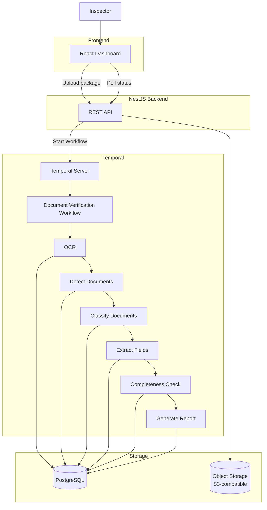

# MVP — AI Document Verification System

## 1. Goal

Build an MVP of an AI-assisted document verification system for government registration workflows. The target domain is real estate / cadastre registration, but the verification mechanism itself is domain-agnostic (see Verification Profiles, section 4.6).

**The system does not make legal decisions.**

Its purpose is to help an inspector quickly verify submitted document packages by:

- collecting uploaded documents
- recognizing document types
- extracting structured data
- validating completeness
- checking consistency between documents
- producing a verification report

The final approval is always performed by a human inspector.

## 2. Scope

The MVP focuses on a single verification flow:

```
Upload Package
      ↓
Store files
      ↓
Split PDFs into pages
      ↓
OCR
      ↓
Document Classification
      ↓
Field Extraction
      ↓
Validation
      ↓
Verification Report
```

Human review workflows and notifications are intentionally left outside the MVP. Orchestration of the pipeline is handled by Temporal (see section 7).

## 3. Supported Input

### File formats

- PDF
- JPG
- JPEG
- PNG

### Upload

A verification package may contain multiple files.

**Each uploaded file is treated as exactly one document.** Files containing multiple logical documents (e.g. a passport and a license scanned into one PDF) are out of MVP scope.

Example:

```
package/
├── passport.pdf
├── driver_license.jpg
└── application.pdf
```

## 4. Functional Requirements

### 4.1 Upload Package

User uploads one or more files.

Backend should:

- create Verification Package
- upload originals to object storage
- store metadata in PostgreSQL
- start the verification pipeline

### 4.2 PDF Processing

Every PDF is automatically split into pages. Each page becomes an individual image for OCR.

Example:

```
passport.pdf
      ↓
page_1.png
page_2.png
```

### 4.3 OCR

Each page is sent to an OCR provider (behind the `OcrProvider` port, see ADR-0003).

The OCR provider returns:

- recognized text
- bounding boxes (optional)
- confidence score

The backend stores OCR results.

### 4.4 Document Classification

Each document is classified based on the OCR text of its pages (one type per document — see section 3). The set of recognizable document types is defined by the active Verification Profile.

The profile the MVP ships with — *First state registration of an individual
residential house* — recognizes:

- Land parcel plan-scheme
- Order (or extract from the order)
- Payment receipt
- Sketch design
- Archival certificate
- Application
- Identity document
- Unknown

Example:

```
submission.pdf pp. 1–2 → Sketch design
```

### 4.5 Field Extraction

Depending on the detected document type, the system extracts structured fields. Field schemas are defined per document type in the Verification Profile.

**Identity document**:

- First Name
- Last Name
- Document Number
- Issue Date
- Expiration Date

**Payment receipt**:

- Receipt Number
- Payer Name
- Amount Paid
- Payment Date
- Payment Purpose

**Application**:

- Applicant Name
- Applicant Identity Document Number
- Property Address
- Cadastral Number
- Application Date

The remaining types declare their own schemas the same way; the profile in
`verification-profile.vo.ts` is the list of record.

Each extracted field stores:

- value
- confidence
- page number

### 4.6 Validation — Verification Profiles

Validation is driven by a **Verification Profile** — a declarative definition of what a valid package looks like: document types, field schemas, required documents, and cross-document rules (see ADR-0002). The engine interprets profiles; adding a new domain (e.g. cadastre document sets) means adding a profile, not changing the engine.

The MVP ships one profile, and checks the **mandatory set only**. Additional
documents a submission may carry are out of scope for now.

#### Required documents

Every type the profile declares is required:

- Land parcel plan-scheme
- Order (or extract from the order)
- Payment receipt
- Sketch design
- Archival certificate
- Application
- Identity document

A required type no document was placed under is reported as missing.

#### Nothing stops the run

By the operator's decision, a missing or unreadable document never halts
verification. A file that will not split, a sheet the reader refuses and a
document nothing can place are each carried through to the report and handed to
the inspector, who decides. A run ends `Failed` only when the machinery lost the
package itself.

#### Unreadable documents

Reported as findings of their own: a sheet OCR could not read, a file that was
never read into documents, a document the classifier could not place.

#### OCR confidence

Readings below the confidence threshold are flagged — a placed type as well as
an extracted field.

Example:

```
confidence < 0.80 → Needs review
```

#### Cross-document validation

The profile declares **cross-document checks**: values several documents of one
submission must state alike. Each check names what is compared, what counts as
agreement, and the `[document type, field]` pairs it reads — the first pair is
the anchor, and the finding is filed against it.

The cadastre profile ships five:

| Check                  | Holds against each other                                                            |
| ---------------------- | ----------------------------------------------------------------------------------- |
| `applicant_identity`   | Surname + given name on the identity document, against the applicant on the application |
| `identity_document_no` | The card's own number, against the number the application quotes                     |
| `property_address`     | The address on the application, plan-scheme, order, sketch design and certificate    |
| `cadastral_number`     | The parcel on the plan-scheme, against the parcel the application is made under      |
| `plot_area`            | The surveyed area, against the area the order allotted                               |

Agreement is a judgement, not a string comparison: a surname is printed in
capitals on the card and in an oblique case on the form, an address abbreviates
one way on one paper and spells itself out on another, and a scan drops
diacritics on both. So the stage states the rule and a reader applies it,
answering **Match**, **Mismatch** or **Unclear**.

- A check needs **two documents** to run. One with a counterpart missing is not
  a disagreement — it is a missing document, and that is already reported.
- A verdict is never surer than the least confident value it weighed: a name
  read at 0.4 cannot produce a mismatch anyone should act on at 0.95.
- **Mismatch** and **Unclear** both become a `FieldMismatch` finding. A check
  nobody could decide is one the inspector has to decide, so it is told to them.
- A check that agreed is kept and reported too: it is what the inspector does
  not have to redo.

`Expired` remains reserved, and no stage produces it yet.

## 5. Verification Report

The final output is a structured report.

Overall status:

- OK
- Issues Found
- Incomplete Package

Every finished run has one, whatever it managed to read.

Report contains:

- detected documents
- extracted fields
- missing documents
- documents that could not be read
- OCR confidence
- page references

Example:

```
Status
  Incomplete Package
---
Missing Documents
  Archival certificate
---
Could Not Be Read
  submission.pdf · p. 4
  pp. 5–6 · submission.pdf — type not recognized
---
Low Confidence
  Document Number
  Confidence 0.61
```

## 6. User Interface

### Dashboard

Displays verification packages.

Columns:

- Package ID
- Created At
- Status
- Progress

### Upload Page

User can:

- upload files
- create package
- start verification

### Verification Details

Shows:

```
Uploaded documents
      ↓
OCR result
      ↓
Extracted fields
      ↓
Validation report
```

Each issue links to:

- page
- field
- confidence

## 7. Architecture — Temporal Workflow Orchestration

### Context

The verification pipeline is long-running and involves unstable external dependencies (third-party OCR provider, classification model). Traditional request-response architectures struggle with:

- Long-running verification processes (OCR, multiple validation stages)
- Transient failures of external services requiring retries
- Complex state management across verification stages
- Need to track intermediate results and resume workflows

### Decision

We adopt **Temporal** to orchestrate the verification workflow:

- Manages the long-running document verification workflow as a single durable execution
- Provides built-in retry logic, timeouts, and resumable workflows
- Maintains complete workflow history for audit trails

### Verification Pipeline

The workflow executes in stages (atomic activities), allowing:

- Efficient parallel processing where possible
- Clear audit trail of what happened and when

No stage stops the run. Each records what it managed to do; what it could not
becomes a finding in the report.

| Stage               | Purpose                                                   | Output                     |
| ------------------- | --------------------------------------------------------- | -------------------------- |
| 1. OCR              | Recognize text on every page                              | OCR results stored         |
| 2. Detect Documents | Read each file into the documents it holds                | Page ranges stored         |
| 3. Classify         | Determine each document's type from its OCR text          | Document types stored      |
| 4. Extract Fields   | Extract structured fields per the profile's field schemas | JSON fields in DB          |
| 5. Cross-document   | Hold the documents against each other on the values the profile says must agree | Cross-check verdicts stored |
| 6. Completeness     | Verify required documents present                         | List of missing docs       |
| 7. Generate Report  | Compile findings with confidence scores                   | Report + validation issues |

### Components

- **NestJS Backend (REST API)**: Document upload, metadata queries, workflow start, status polling
- **PostgreSQL**: Structured application data (users, document metadata, validation results)
- **Object Storage (S3-compatible)**: Raw documents, OCR images, generated reports — decouples compute-heavy OCR/ML from the transactional database

The inspector checks verification status via the REST API (polling); real-time push updates and notification channels are out of MVP scope.

### Architecture Diagram


```mermaid
flowchart TD
User[Inspector]

    subgraph Frontend
        UI[React Dashboard]
    end

    subgraph Backend[NestJS Backend]
        API[REST API]
    end

    subgraph Workflow[Temporal]
        TS[Temporal Server]

        WF[Document Verification Workflow]

        A1[OCR]
        A2[Detect Documents]
        A3[Classify Documents]
        A4[Extract Fields]
        A5[Completeness Check]
        A6[Generate Report]
    end

    subgraph Storage
        DB[(PostgreSQL)]
        OBJ[(Object Storage\nS3-compatible)]
    end

    User --> UI

    UI -->|Upload package| API
    UI -->|Poll status| API

    API --> OBJ
    API -->|Start Workflow| TS

    TS --> WF

    WF --> A1
    A1 --> A2
    A2 --> A3
    A3 --> A4
    A4 --> A5
    A5 --> A6

    A1 --> DB
    A2 --> DB
    A3 --> DB
    A4 --> DB
    A5 --> DB
    A6 --> DB
```

### Rationale

**Why Temporal?**

- Temporal handles the complexity of long-running, multi-step workflows
- Built-in compensation (retry, timeout, dead-letter queues) for unstable external calls (OCR provider, ML model)
- Complete audit trail: what happened, when, in what order
- Workflows survive worker restarts and resume from the last completed activity

### Alternatives Considered

| Approach                            | Pros                | Cons                                               | Why Not?                                    |
| ----------------------------------- | ------------------- | -------------------------------------------------- | ------------------------------------------- |
| **Synchronous API** (current model) | Simple, familiar    | Timeouts on long-running OCR, fragile retries      | Can't handle long-running workflows         |
| **Job Queue (Bull, RabbitMQ)**      | Lightweight, proven | Manual retry logic, harder to track workflow state | Less suitable for multi-stage workflows     |
| **Custom Workflow**                 | Full control        | Massive engineering effort, maintenance burden     | Reinventing the wheel                       |

### Implementation Notes

1. **Workflow Activities** map to verification stages (S1–S6)
2. **Failure Handling**: Activities auto-retry on transient errors (OCR service down); surface permanent failures to the inspector via package status
3. **Audit Trail**: Query Temporal's workflow history for "what happened to this document package?"
4. **MVP staging**: the first implementation runs these stages as an in-process pipeline inside the NestJS backend, keeping the activity shape so they can be lifted into Temporal later (ADR-0001)

### Related Decisions

- [ADR-0001](./adr/0001-in-process-pipeline-before-temporal.md): In-process pipeline first, Temporal-shaped
- [ADR-0002](./adr/0002-profile-driven-validation.md): Verification Profiles instead of hardcoded rules
- [ADR-0003](./adr/0003-external-capabilities-behind-ports.md): External capabilities behind abstract-class ports
