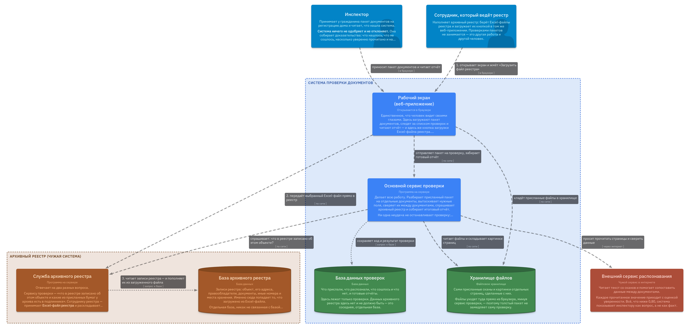

The architecture diagrams are **source, not pictures**. The `.c4` files in this
folder are the model; the PNGs in `exports/` are generated from them and are
never edited by hand. Change the model, re-export, commit both.

Written with [LikeC4](https://likec4.dev) — a DSL that keeps one model and
projects several views out of it, so the container diagram and the ERD cannot
drift apart the way two hand-drawn pictures do.

The pictures below are the exported PNGs. They are wide — click one to open it
full size, or run `npx -y likec4@1 start docs/architecture` and pan around the
live model instead.

## System context — who uses this, and what it depends on

The archive register is drawn **outside** the system on purpose:
`apps/registry-stub` is run by us today, but it stands in for a system that is
not ours and is deleted rather than migrated when a real one answers the same
contract (ADR-0009).

[](exports/index.png)

## Containers — what actually runs

`apps/web` → `libs/api-gateway` → `packages/verification` → `apps/registry-stub`,
the sketch in `CONTEXT-MAP.md` made literal. The gateway and the verification
context are one process, `cadastre-core`; the seam between them is
`@cadastre/api-contracts`, and it is the only thing that has to change if
verification ever becomes its own service.

Two databases, not one, and no edge between them.

Two people, too. The register operator loads the archive's own Excel files
through `apps/web` and never submits a package — which is why `apps/web` has one
arrow that does not go through the gateway: the register's import is deliberately
outside `@cadastre/api-contracts` (ADR-0011 §1, TECH_DEBT §10).

[](exports/containers.png)

## The same containers, for somebody who does not write code

`po.c4` is the container view told a second time, in Russian and in the words a
product owner uses: *Рабочий экран*, *Основной сервис проверки*, *База данных
проверок*. It carries the instruction for loading an Excel register file into
the archive register — which button, in what order, what the report means — in
its own description and in the description of the register service, so it is
read beside the picture rather than in a separate document.

It adds **no elements of its own**: every block is the element `system.c4`
already declares, with title, technology and description replaced for the length
of that one view (`include … with { … }`). A container that leaves the system
leaves both pictures, so the two cannot drift apart.

[](exports/po.png)

## Components of `cadastre-core` — the ports-and-adapters seam

The pipeline names a port; `apps/server/src/infrastructure/index.ts` binds it to
one of these adapters. Every provider has a `mock` implementation of the same
port, which is why the whole pipeline runs offline.

[](exports/backend.png)

## The verification run, upload to report

`RunVerificationHandler.execute`, stage by stage. Two rules govern the whole
sequence: **no stage may stop the run** — a file that will not split, a sheet
the reader refuses, an archive that does not answer, each becomes a line in the
report and the run goes on — and **nothing below 0.80 confidence is a fact**, it
is a question for the inspector.

[](exports/verificationProcess.png)

## ERD — `cadastre-db`, the verification context

Thirteen tables. An edge runs from the table holding the foreign key to the one
it references, labelled with the column and what happens to the row when the
referenced one goes. Verification Profiles are not here: they live in code
(ADR-0002).

[](exports/erdCadastreDb.png)

## ERD — `cadastre-registry`, the archive register

Six tables, everything hanging off one object keyed
`(territorialOffice, registerNo)` — not off the address, which is never unique
and never was.

[](exports/erdCadastreRegistry.png)

## ERD — both databases

Both schemas in one picture and deliberately **without a single edge between
them**. A join between a submission and the record of a registration is the one
thing that must stay impossible; two databases make it a network call, which is
what it actually is (ADR-0010). If an edge ever appears across this gap, the
model is wrong or the code is.

[](exports/erdBothDatabases.png)

## The files

| File                        | What is in it                                                                |
| --------------------------- | ---------------------------------------------------------------------------- |
| `specification.c4`          | The vocabulary: element kinds, tags, relationship kinds and their styling     |
| `system.c4`                 | The C4 model — people, systems, containers, components, and what talks to what |
| `erd-cadastre-db.c4`        | The tables of `cadastre-db`, nested inside its container                      |
| `erd-cadastre-registry.c4`  | The tables of `cadastre-registry`, nested inside its container                |
| `views.c4`                  | The seven engineering views above                                             |
| `po.c4`                     | The eighth view: the containers, retold for a non-technical reader            |
| `az-cadastre.c4`            | **Generated.** The six above as one document, for the playground              |
| `bundle.sh`                 | Regenerates `az-cadastre.c4`                                                   |
| `likec4.config.json`        | Names the project and keeps `az-cadastre.c4` out of the workspace              |

The ERDs hang off the same elements the C4 views use: `cadastre.cadastreDb` is a
container in `containers` and the parent of thirteen tables in `erdCadastreDb`.
That is the reason for one model rather than two — the databases in the C4
picture and the databases in the ERD are the same two objects, and the fact that
nothing joins them is a property of the model, not of how carefully somebody
drew it.

Each table reads: title is the table name, the small line under it is the keys,
the body is the columns (`?` marks nullable), and the details pane holds the
prose. `id`, `createdAt` and `updatedAt` are left out of the column lists —
every table has them. A node body clips at five lines, which is why
`registry_objects` counts its ten area and ownership columns instead of naming
them; its `description` spells all twenty-two out.

## Running it

No dependency was added to the repo for this — LikeC4 is a one-off tool, run
through `npx` from the repository root:

```bash
# Interactive browser: click into a view, follow the links, read the prose.
# This is the one to use while editing — it hot-reloads on save.
npx -y likec4@1 start docs/architecture

# Syntax, references, and whether every view still lays out.
npx -y likec4@1 validate docs/architecture

# Re-export the PNGs. Two commands: the model declares the process view as a
# sequence diagram and `start` honours that, but `export png` wants the flag.
npx -y likec4@1 export png docs/architecture -o docs/architecture/exports --flat
npx -y likec4@1 export png docs/architecture -o docs/architecture/exports --flat \
  --seq -f verificationProcess
```

`export png` drives a headless Chromium through Playwright. On a machine that
has never run Playwright, the first export asks for it:
`npx -y playwright@1.60 install chromium` — match the version to the
`playwright-core` LikeC4 pulls in, or the browser it downloads is not the
revision it looks for. On a distribution Playwright 1.60 has no build for
(Ubuntu 26.04, for one) that install refuses; point
`PLAYWRIGHT_BROWSERS_PATH` at a Chromium another Playwright already fetched
instead. Everything else — `start`, `validate`, the language server — needs no
browser.

LikeC4 exports PNGs with a transparent background — they take the colour of
whatever page they are read on, which is why they look right in both GitHub
themes and wrong in an image viewer that paints alpha black.

### One file, for the playground

[playground.likec4.dev](https://playground.likec4.dev) takes a single document,
so the six files are also committed joined, as
[`az-cadastre.c4`](az-cadastre.c4). Copy that file, paste it there, and all
eight views are in the list. Joining needs no rewriting: a `.c4` document may
hold any number of `specification`, `model` and `views` blocks, and references
resolve across the whole of it.

It is **generated**. Edit the six sources and run:

```bash
docs/architecture/bundle.sh
```

Two consequences worth knowing before you move it:

- `likec4.config.json` lists it under `exclude`. Without that the tool loads the
  bundle *and* its six sources, every element is declared twice, and the whole
  workspace stops resolving — a subfolder does not help, the scan is recursive.
  Note that setting `exclude` replaces the default, which is why
  `**/node_modules/**` is spelled out again there.
- Links in the model are absolute GitHub URLs rather than repository-relative
  paths, because `../MODELS.md` resolves against the dev server in
  `likec4 start` and against nothing at all in the playground.

## Editing

- The model is the whole tree, not one file per diagram: an element declared in
  `system.c4` is extended with its tables in `erd-cadastre-db.c4`. Names are
  resolved across all files in the folder.
- Keep the model honest about **this** code. Component titles are package paths
  and class names (`libs/api-gateway`, `RunVerificationHandler`) so that a
  diagram which has drifted can be told from one that has not, by grep.
- `po.c4` is the one place where that rule is inverted, and only in the labels:
  it renames the same elements for a reader who does not know what a gateway is.
  A container added to `containers` is added to `po` in the same commit, or it
  shows up there under its package path.
- When a schema changes, the ERD changes with it in the same commit. The Prisma
  files are the source of truth: `packages/verification/src/infrastructure/persistence/schema/`
  and `apps/registry-stub/src/infrastructure/persistence/schema/`.
- `npx -y likec4@1 format docs/architecture` formats the `.c4` files; the
  repository's prettier does not cover them.
- There is a VS Code extension (`likec4.likec4-vscode`) which gives the same
  preview and diagnostics inside the editor.

## Why here, and no ADR

`docs/architecture/` beside `docs/adr/`, because these are the same kind of
artefact: a statement about the shape of the system that outlives the code that
prompted it. No ADR was written for this — where diagrams live is a convention,
not a decision anyone would argue about, and the decisions the diagrams *show*
already have their ADRs (0006, 0009, 0010) and are cited from the views that
show them.
